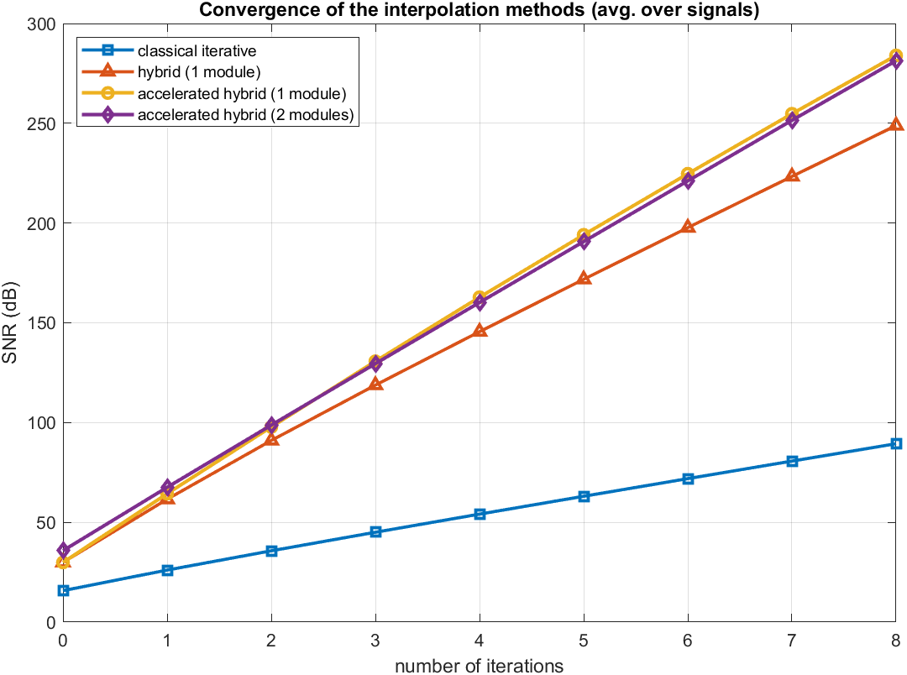
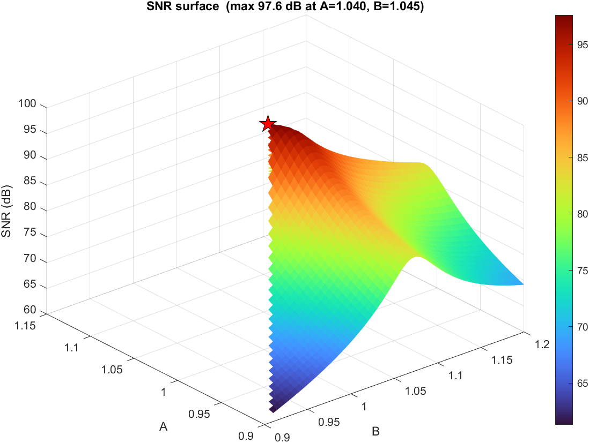
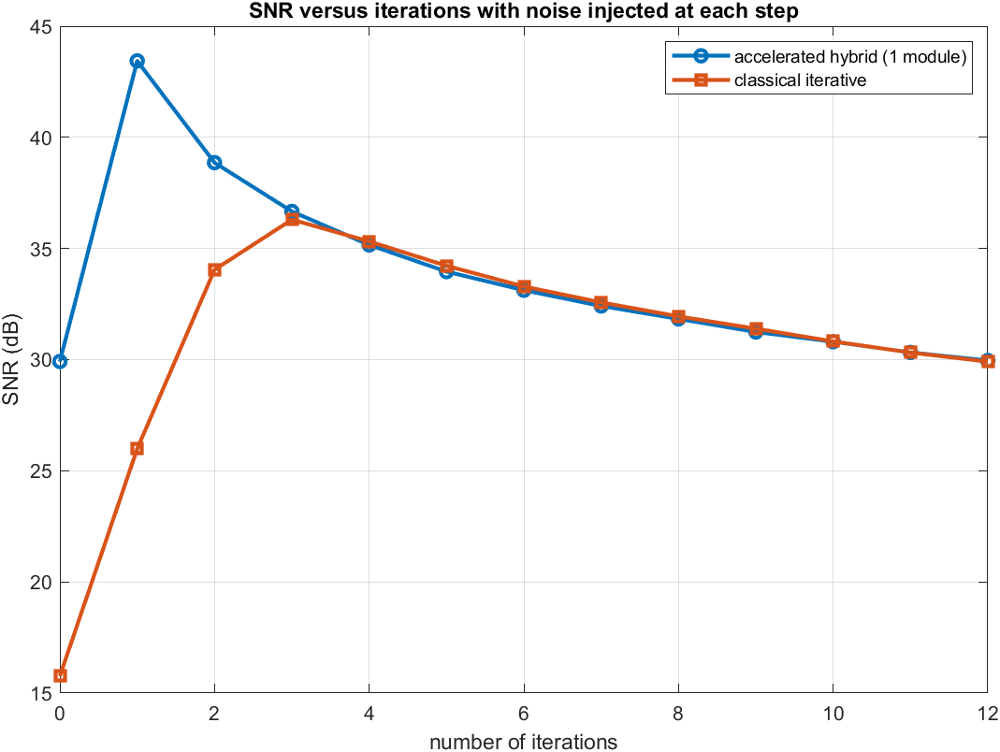

# Hybrid Iterative Interpolation

MATLAB implementation of the Chebyshev-accelerated **hybrid iterative interpolation**
method for reconstructing a bandlimited signal from its Nyquist-rate
sample-and-hold output — reaching ~100 dB SNR in **two** iterations where the
classical iterative method needs a dozen.

> A. ParandehGheibi, M. A. Akhaee, F. Marvasti,
> *"Design of Interpolation Functions Using Iterative Methods"*,
> 14th European Signal Processing Conference (EUSIPCO), 2006.

The repository reproduces the paper's Figures 2 and 3, plus the experimental
search for the frame bounds the accelerated method needs.

---

## The problem

A digital-to-analog converter holds each sample for a full period, so what
actually leaves the D/A is a staircase, not the bandlimited signal. The hold
distorts the spectrum with a `sinc` envelope and leaves the replicas only
partly suppressed. Simply lowpass-filtering the staircase is the classical fix
and it is not very good.

## The idea in one paragraph

Define two operators:

- **S** — sample-and-hold (`zoh_operator.m`)
- **P** — the *modular* band-limiter (`modular_operator.m`): multiply by the
  truncated Fourier series of the sampling comb, `g(t) = 1 + 2·Σ cos(2πst/L)`,
  then ideal-lowpass to the baseband.

The composite **P·S is almost the identity** on the baseband
(`‖I − P·S‖ ≈ 0.06` with a single module). So take the measurement
`D = P·S·x` and iterate an estimate `y` until `P·S·y = D`; then `y → x`.
Plain relaxation converges slowly. **Chebyshev acceleration** reuses the last
two estimates and reaches the same fixed point in a couple of iterations.

Setting `modules = 0` collapses **P** to a plain lowpass filter, which recovers
the classical method — so the same code runs all four variants compared below.

---

## Results

SNR averaged over 20 bandlimited random signals (`study_convergence.m`,
reproducing the paper's Figure 2):

| iterations | classical | hybrid (1 module) | accelerated (1 module) | accelerated (2 modules) |
|-----------:|----------:|------------------:|-----------------------:|------------------------:|
| 0 | 15.8 dB | 29.9 dB | 29.9 dB | 35.8 dB |
| 1 | 26.1 dB | 61.6 dB | 64.4 dB | 67.5 dB |
| 2 | 35.7 dB | 91.0 dB | **97.8 dB** | 98.7 dB |
| 3 | 45.0 dB | 118.8 dB | 130.7 dB | 129.5 dB |
| 4 | 54.1 dB | 145.6 dB | 162.8 dB | 160.2 dB |



This matches the paper's headline claims — ~64 dB after a single accelerated
iteration and ~98 dB after two, against ~36 dB for the classical iterative
method — with the convergence rate improving from ~9 dB/iteration to
~33 dB/iteration. A second module helps at the first iteration and then stops
paying for itself, which is why one module is the sensible default.

On a single test signal (`demo_single.m`, sum of tones) the raw sample-and-hold
staircase measures **11.9 dB**; two accelerated iterations with one module bring
it to **102.6 dB**.

`study_frame_bounds.m` sweeps a 41 × 61 grid and finds the best pair at
**A = 1.040, B = 1.045** (97.6 dB) — a broad, shallow optimum, so the 1.03 /
1.05 used elsewhere in the repository sits comfortably inside it.



`study_noise.m` reproduces Figure 3: with white Gaussian and uniform
(quantisation-like) noise injected at *every* step, the SNR climbs while the
interpolation converges and then rolls off as the injected noise accumulates.
Averaged over 20 realisations at σ = 2e-3, the hybrid method peaks at
**43.4 dB after a single iteration** — it extracts what the noise floor allows
before the noise starts to dominate, where the classical method is still far
from its own peak.



---

## Running it

Requires MATLAB (developed on R2024a; no toolboxes beyond core FFT operations).

```matlab
cd hybrid-iterative-interpolation
selftest            % quick headless numeric check, prints SNR per iteration
demo_single         % one reconstruction, with plots
study_convergence   % Figure 2 — SNR vs iterations, four methods
study_frame_bounds  % grid search for the frame bounds A, B
study_noise         % Figure 3 — behaviour under per-step noise
```

---

## Files

| File | Role | Paper reference |
|------|------|-----------------|
| `zoh_operator.m` | operator **S** — zero-phase sample-and-hold | Sec. 2 |
| `modular_operator.m` | operator **P** — modular mixing + ideal LPF | Eq. 1–3 |
| `hybrid_reconstruct.m` | the reconstruction engine (both methods) | Eq. 4, 26–28 |
| `snr_metric.m` | SNR in dB, ignoring 10% edges | Sec. 4 |
| `make_test_signal.m` | bandlimited / tones / chirp test signals | Sec. 4 |
| `demo_single.m` | reconstruct one signal, with plots | — |
| `study_convergence.m` | **Figure 2** — SNR vs iterations, four methods | Fig. 2 |
| `study_frame_bounds.m` | grid search for the frame bounds A, B | Sec. 3.3 |
| `study_noise.m` | **Figure 3** — robustness with per-step noise | Fig. 3 |
| `selftest.m` | headless numerical check | — |
| `results/figures/` | figures from one full run | — |
| `prototype/` | earlier, flatter first pass at the same method | — |

`hybrid_reconstruct.m` takes a parameter struct:

```matlab
p.L       = 64;             % hold factor / oversampling ratio
p.modules = 1;              % cosine modules M in P  (0 -> classical method)
p.iters   = 2;
p.method  = 'accelerated';  % or 'iterative'
p.relax   = 0.94;           % relaxation factor, 'iterative' only
p.A = 1.03;  p.B = 1.05;    % frame bounds, 'accelerated' only
```

---

## The maths, mapped to the code

**Sample-and-hold, made zero-phase.** A held sample lags its instant by half a
hold interval (the `T/2` group delay of a ZOH). `zoh_operator.m` removes it with
a circular shift of `L/2`, so **S** stays aligned with the lowpass filter.

**Modular band-limiter (Eq. 1–3).** `g(t) = 1 + 2·Σ_{s=1..M} cos(2πst/L)` is the
truncated Fourier series of the Dirac comb of period `L`. Mixing with it and
lowpass filtering folds the hold's spectral replicas back so that they cancel
the distortion.

**Classical iteration (Eq. 4).** `y ← y + λ(D − P·S·y)`, with `λ ≈ 0.94`.

**Chebyshev acceleration (Eq. 26–28).** With frame bounds `A < B`,
`ρ = (B−A)/(B+A)` and `α = 2/(A+B)`:

```
y0 = D
y1 = D + α(D − P·S·y0)
λ1 = 2 ,  λn = 1 / (1 − (ρ²/4)·λ(n−1))                        % Eq. 27
yn = λn·( y(n−1) + α(D − P·S·y(n−1)) − y(n−2) ) + y(n−2)      % Eq. 26
```

`A` and `B` have no closed form. `study_frame_bounds.m` finds a good pair by
grid search (1.040 / 1.045 for one module here), matching the paper's note that
they are chosen experimentally, once, up front. The optimum is shallow, so
nearby pairs such as 1.03 / 1.05 perform essentially the same.

---

## One implementation subtlety worth knowing

The ideal lowpass filter must zero a **conjugate-symmetric** band. If the cut is
off by one bin it keeps the positive Nyquist bin but drops the negative one; a
real signal then loses that bin's energy on every pass and the SNR sticks at a
floor (~35 dB) no matter how many iterations you run. `modular_operator.m` zeros
`X(K+1 : n-K+1)`, which is symmetric about DC in MATLAB's 1-based indexing, so
`P·S` stays a true near-identity and the iteration converges to the full ~100 dB.

---

## Citation

If the method is what you need, cite the original paper:

```bibtex
@inproceedings{parandehgheibi2006interpolation,
  author    = {ParandehGheibi, Ali and Akhaee, Mohammad Ali and Marvasti, Farokh},
  title     = {Design of Interpolation Functions Using Iterative Methods},
  booktitle = {14th European Signal Processing Conference (EUSIPCO)},
  year      = {2006}
}
```

The paper PDF is not redistributed here — it is available through the EUSIPCO
proceedings.

## License

MIT — see [LICENSE](LICENSE). The license covers this implementation, not the
paper it reproduces.
